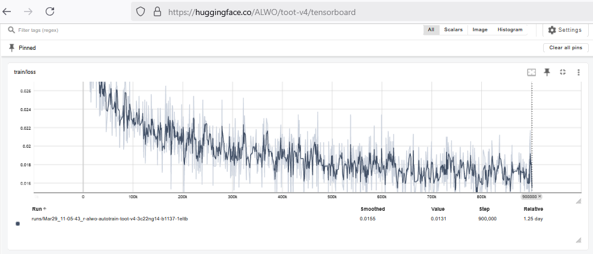

The goal of this project was to explore how IRIS Database implementation can satisfy search requirements leveraging AI.

Chat-with-AI is a familiar, simple textual interface, achieving higher productivity.

Question: What happens if a need cannot be easily expressed in textual form?

Hypothesis: 
A conversation with a colleague could be:
> "Hey what was that tune earlier?
> The one that went "do do dee doo da"?

Instead of text input, can we explore "Sound" as input, and in a novel way use IRIS new AI search capabilities to achieve this?

# The Interface
The [TOOT](https://localhost/iris/csp/toot/TOOT.Web.Button.cls) interface consists of a button.


1. Press the button
2. Whistle or sing a tune
3. Review the results


# AI collateral
* Tailored tokenizer vocabulary
* Unsupervised base model training
* Supervised Similarity training with SentenceTransformer
* Synthetic data generation for similarity training




# IRIS product areas exercised:
* Vector Embedding Search
* Loading Data Embeddings with record insert
* Extending the IRIS Embedding Interfce
* Python in BPL
* Interop with shell utilities


# Docker recipie
There were a lot of dependencies packed in, to get this working out of the container.
Took a lot of rebuild and testing to get right.
Anticipate some reuse value in the Dockerfile investment.
* Local packaged model
* Encoding data
* Production
* Shell integrated utilities

# Installation
Note: GitHub constrains max upload filesize to 25MB.
Due to time constraints am asking the developer please to use for example 7-zip to unpack the spanned archives.
Later can review and resolve this in a better way. Possibly direct download via Docker file.
Thank you for your patience.
Note: The dependencies involved result in a docker large image file ( 8.15GB ) 

1) Download the repository files
2) Unzip the spanning archives in "/src/data"
3) Unzip the spanning archives in "/model"
4) In the main directory on commandline run:
   ```bash
   docker build -t toot .
   docker run --rm --name toot -d -p 1972:1972 -p 52773:52773 -p 80:80 -p 443:443 toot
   docker exec -u root toot apachectl start
   ```
The docker appliance will take a long time to build. However the image will start and restart quickly.
The Ensemble Integration Production is registered to start automatically.
To explore the Python in BPL use the [management portal](http://127.0.0.1:52773/iris/csp/sys/UtilHome.csp).

Application access is provided by TLS. This is a security constraint of web browsers.
Only web pages delivered over HTTPS may use Audio and Video recording capabilities.

The ambition was high. Many discoveries. Would be good to write some new articles on the [developer forum](https://community.intersystems.com/)


